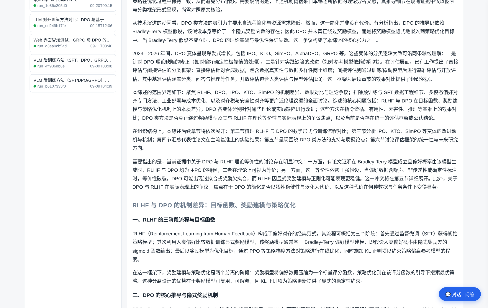
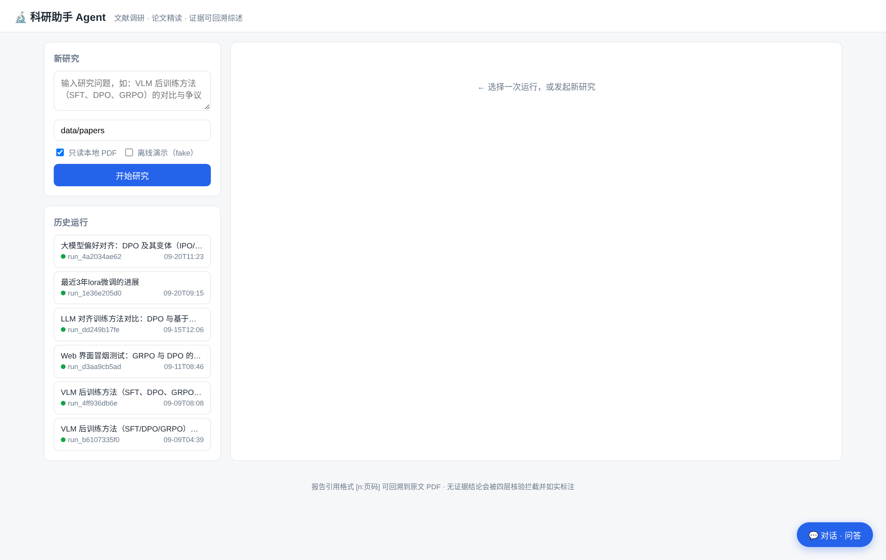
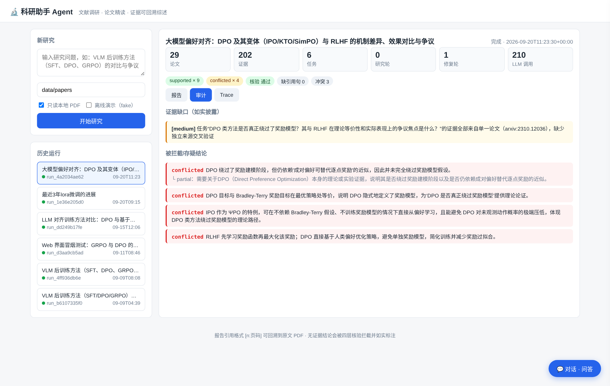
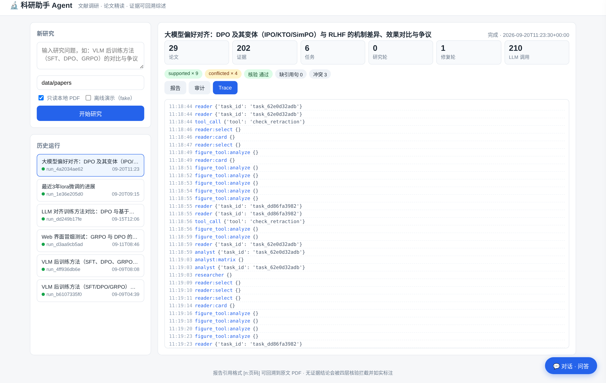
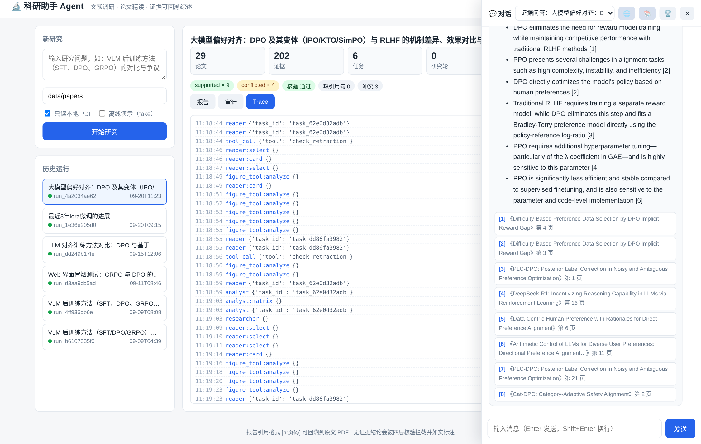

# ResearchTrace · 研溯

> **科研助手 Agent** — 多智能体文献调研系统：输入一个研究问题，输出一份**每条结论都可回溯到论文、页码与原始证据**的研究报告。

面向**选题调研、论文精读、文献综述与研究方案设计**。它不只是"生成一份像综述的文档"——正文引用 `[n:页码]` 可定位到 PDF 原文，所有结论经过四层核验，**核验不过的结论如实标注而非删除，证据不足的缺口如实披露而非掩盖**。

<p align="center">
  
</p>

## ✨ 核心特性

- **证据可溯源**：结论以内部引用键 `[paper_id:页码]` 起草，渲染为正文 `[n:页码]` + 编号参考文献；文本证据为逐字抽取的原文片段，可回溯定位。
- **四层核验**（Verifier）：元数据核验（Crossref）→ 引用蕴含（独立 Judge，禁用自身知识）→ 覆盖率（逐句检查）→ 一致性（冲突结论并列呈现）。
- **诚实降级**：达到轮次上限仍缺证据时不继续循环，在报告中明确标注"证据不足 / 结论存在冲突"；被拦截的 unsupported 结论进入审计视图而非被静默删除。
- **多智能体管线**：LangGraph 状态机编排，STORM 式五视角拆解，Researcher 经 `Send` fan-out 并行执行，Searcher 采用受限 ReAct（工具白名单 + 5 次调用上限 + 停滞检测）。
- **多通道检索**：arXiv / Semantic Scholar / Crossref / AnySearch 学术垂直域，互为限流兜底；中文查询自动译成英文检索式。
- **PDF 精读**：PyMuPDF 结构感知解析 + BM25/bge-m3 混合检索（跨语言语义召回）+ 两段式 LLM 抽取（单批失败只降级该批）；PaperQA2 可作为可选精读后端。
- **图表证据**：区域检测 → PNG 渲染 → VLM 内传解读 → 绑定页码/图号（依赖所配视觉模型，不可用时自动降级为"仅登记"）。
- **跨 run 知识库**：Milvus Lite 向量库 + SQLite 结构化记忆，新研究自动预热相关历史证据与论文（统一内容哈希身份，防重复下载与重读）。
- **Web 界面 + 三模式对话**：研究发起/进度/报告/审计/Trace 一页俱全；对话抽屉支持 ① 历史 run 证据问答（RAG，回答逐条 `- 结论 [n]`）② 联网搜索问答 ③ 知识库全库问答。
- **优雅降级**：任一外部依赖（LLM/检索/向量库/嵌入/VLM）未配置或失败均有兜底，主流程绝不中断。
- **离线可测**：157 个单元/集成测试全部离线运行（FakeBackend 按 `#FAKE:` 标记路由），CI 不烧 token。

## 📸 界面预览

| 研究主页：发起新研究 + 历史运行 | 报告视图：`[n:页码]` 引用 + 参考文献 |
|---|---|
|  |  |

| 审计视图：证据缺口与被拦截结论 | Trace 视图：节点级事件回放 |
|---|---|
|  |  |

**证据问答**（选定历史 run 后对其证据库做 RAG 问答，回答逐条给出 `- 结论 [n]`，可展开对应论文与页码；无引用的回答自动重写一次，仍无则按"证据不足"处理并折叠原稿）：

<p align="center">
  
</p>

## 🏗️ 架构

```
┌──────────────────────── 研究管线（src/graph.py，LangGraph）────────────────────────┐
│                                                                                   │
│  Scope ──含 kb_prime（Milvus 知识库预热：注入相关历史证据+论文）                      │
│    → Planner（STORM 五视角分解）                                                    │
│    → Supervisor（纯规则派发）→ Researcher ×N 并行                                    │
│        ├─ Searcher（受限 ReAct：arXiv/S2/Crossref/AnySearch 学术/PDF 下载/在线阅读）  │
│        ├─ Reader（PDF 精读：解析→混合检索→两段式抽取→VLM 图表）                        │
│        ├─ Analyst / Critic（对比矩阵、冲突与反例）                                    │
│    → Gap Analyzer（≤2 研究轮）→ Outline → Writer → Verifier（四层）                  │
│    → Repair（≤2 修复轮）→ Finalize（报告+审计包+SQLite 记忆+Milvus 知识库写入）        │
└───────────────────────────────────────────────────────────────────────────────────┘
```

| 阶段 | 节点 | 职责 |
|---|---|---|
| 定界 | `scope` | 生成 Research Brief（目标/边界/时间范围/判断标准） |
| 规划 | `planner` | STORM 式五视角拆解（背景/方法/实验/应用/批判），语义去重 |
| 派发 | `supervisor` | 纯规则治理：批次/并发/工具白名单/预算 |
| 研究 | `researcher` ×N 并行 | 检索 → 下载 → 精读 → 抽取证据 → 对比分析 |
| 汇聚 | `gap_analyzer` | 五类缺口规则 + 定向补检索；`research_round ≤ 2` |
| 写作 | `outline`+`writer` | 只消费论文卡片与 Evidence Store；引用写内部键 `[paper_id:page]` |
| 核验 | `verifier` | 元数据核验 / 引用蕴含 / 覆盖率 / 一致性 |
| 修复 | `targeted_research` | unsupported→定向补检索、citation_missing→重绑（禁止凭空补引用）；`repair_round ≤ 2` |
| 交付 | `finalize` | 渲染编号引用、SQLite 持久化、报告+审计包+Trace 落盘 |

关键数据流约定：模块间只交换 `src/schemas.py` 的 `ResearchTask / PaperRecord / EvidenceRecord / ClaimRecord`；Writer 只能引用 Evidence Store 里已有的证据，不碰 PDF 原文。

## 📦 安装

```bash
git clone https://github.com/galaaaaaa/ResearchTrace.git && cd ResearchTrace
uv venv --python 3.12 .venv
uv pip install --python .venv/bin/python -e ".[dev]"        # 基础（全离线可测）
uv pip install --python .venv/bin/python -e ".[dev,web,kb]" # 完整：Web 界面 + Milvus 知识库
cp .env.example .env    # 填入模型密钥；学术 API 与搜索均为可选
```

可选 extra：`web`（FastAPI/uvicorn）、`kb`（pymilvus[milvus_lite]）、`paperqa`（PaperQA2 精读后端）——均优雅降级，不装不崩。

### 配置（`.env`）

模型走 Anthropic 兼容端点（智谱 BigModel / DeepSeek `https://api.deepseek.com/anthropic` 等，见 `.env.example` 注释）：

```ini
ANTHROPIC_BASE_URL=https://api.deepseek.com/anthropic
ANTHROPIC_AUTH_TOKEN=<your-key>
ANTHROPIC_MODEL=deepseek-flash
```

可选配置：`SEMANTIC_SCHOLAR_API_KEY`（缓解 S2 匿名限流）、`WEB_SEARCH_PROVIDER` + 对应密钥（联网对话：zhipu / anysearch / iqs 三服务商）、`EMBEDDING_*`（bge-m3 网关，启用混合检索与知识库）、`CHAT_MODEL`（对话单独换模型）。全部外部依赖未配置时自动降级，主流程不中断。

## 🚀 使用

### CLI

```bash
# 完整研究（在线检索 + 下载 + 精读 + 报告）
.venv/bin/python app.py research "VLM 后训练方法（SFT/DPO/GRPO）的对比与争议" --papers-dir data/papers

# 只读本地 PDF（离线，不检索）
.venv/bin/python app.py research "DPO 与 RLHF 的关系" --papers-dir data/papers --no-download

# 离线 fake 模式（零网络零 token，无需任何密钥即可体验全流程）
.venv/bin/python app.py research "测试问题" --fake

# 审计包摘要 / 指标评估
.venv/bin/python app.py audit outputs/audit/run_xxx.json
.venv/bin/python app.py eval outputs/audit/run_xxx.json --trace data/traces/run_xxx.jsonl
```

### Web 界面

```bash
.venv/bin/python webapp.py            # 默认 http://127.0.0.1:8300
.venv/bin/python webapp.py --host 0.0.0.0 --port 8300   # 局域网访问（无鉴权，勿暴露公网）
```

浏览器输入研究问题 → 后台执行完整流程 → 实时进度（阶段/论文/证据/轮次计数 + 节点级 trace）→ 报告/审计/Trace 三视图 → 历史 run 列表。右下角 💬 对话抽屉三模式：

- **证据问答**：选定某个已完成 run，对其证据库做 RAG 问答（BM25 + 稠密重排 + 查询扩展），回答以 `- 结论 [n]` 逐条给出并可展开来源论文页码；
- **联网对话**：🌐 开关启用搜索增强（三服务商可配），回答标注可点击来源；
- **知识库问答**：📚 开关对历史 run 的全部证据做向量检索问答。

防线与主流程同一哲学：无引用的回答自动重写一次，仍无则按"证据不足"处理，范围外问题如实拒答。

### 产物路径

| 产物 | 路径 |
|---|---|
| 研究报告（含页码引用与参考文献） | `outputs/reports/{run_id}.md` |
| 审计包（claims 状态/四层核验/证据/预算） | `outputs/audit/{run_id}.json` |
| 节点级 Trace（JSONL 回放） | `data/traces/{run_id}.jsonl` |
| 结构化记忆 / 向量知识库 / 向量缓存 | `data/indexes/` |
| 论文 PDF（下载与本地种子） | `data/papers/` |

### 测试与维护

```bash
.venv/bin/python -m pytest tests/                      # 全量离线测试
.venv/bin/python scripts/rerender_report.py outputs/audit/run_xxx.json  # 渲染升级后离线重渲
.venv/bin/python scripts/backfill_kb.py                # 知识库存量回填（幂等；勿与 webapp 同时跑）
```

## 🧪 评测

| 维度 | 指标 | 工具 |
|---|---|---|
| 引用质量 | citation precision / conflicted 率 | `python -m src.eval.citation_eval` |
| 报告质量 | 金标要点覆盖率 / 必引论文命中率 | `python -m src.eval.coverage_eval` |
| Agent 行为 | 工具调用数、重复搜索率、停止正确率、token/延迟 | `python -m src.eval.agent_eval` |
| 功能 | Schema 校验、DOI 一致性、Claim→Evidence 可回溯、页码可定位、预算即停 | `pytest tests/` |

一次真实全流程运行的验收数据（在线检索 + 本地种子，约 3.4 小时）：29 篇论文、202 条证据、13 条结论（9 supported + 4 conflicted 真实冲突并列）、引用核验通过；文本证据 87/87 可回溯到 PDF 原文，其中 75/87 页码精确、其余在标注页 ±1 内（chunk 重叠所致）。

## ⚠️ 已知限制

- **图表/表格数值依赖 VLM 目读截图**，误读不可程序化校验；每篇只读面积前 4 个图表区域。需所配模型支持图像内传（不支持时自动降级为"仅登记"）。
- 扫描 PDF 无内置 OCR（检测为扫描件后标记 partial）；IEEE 落地页反爬过不去（人工下载 PDF 放入 `data/papers/` 即可，管线全自动消化本地 PDF）。
- chunk 重叠前缀使引用页码偶有 ±1 偏差（检索上下文设计使然）。
- milvus-lite 为进程级独占锁：webapp 与 backfill 不能同时跑。
- arXiv export API 存在间歇性 IP 限流（PDF 主站独立不受影响）；S2 匿名限流较严（配 API key 可缓解）。

## 🧭 设计要点

- **数据契约先行**：所有模块只交换 schema 化的数据结构，prompt 只是实现细节。
- **桩过滤**：Reader LLM 失败会写入桩文本作为提示，但桩绝不能成为结论——writer 抽取与规则兜底双路径过滤。
- **并行安全**：论文/证据经自定义 Reducer 去重合并；TokenBudget 全局线程安全计数，超限即停。
- **分层记忆**：工作记忆=LangGraph State；证据记忆=SQLite；情景记忆=JSONL Trace；语义/程序性记忆=Skill YAML（候选→离线验证→人工启用，不自动上线）。
- **身份统一**：论文一律按 PDF 内容哈希建立 paper_id，跨 run 复用时与检索来源的 `arxiv:`/DOI 身份自动归并，防止论文池碎片化。

## 📚 开源参考

本项目实现过程中参考了以下开源项目的设计思想：

- [PaperQA2](https://github.com/Future-House/paper-qa) — 高质量论文问答与证据抽取（两段式 Reader 设计对照）
- [Stanford STORM](https://github.com/stanford-oval/storm) — 多视角问题生成
- [GPT Researcher](https://github.com/assafelovic/gpt-researcher) — Planner–Executor–Publisher 职责划分
- [Deep Agents](https://github.com/langchain-ai/deepagents) / [Deep Research From Scratch](https://github.com/langchain-ai/deep_research_from_scratch) — 多智能体研究编排
